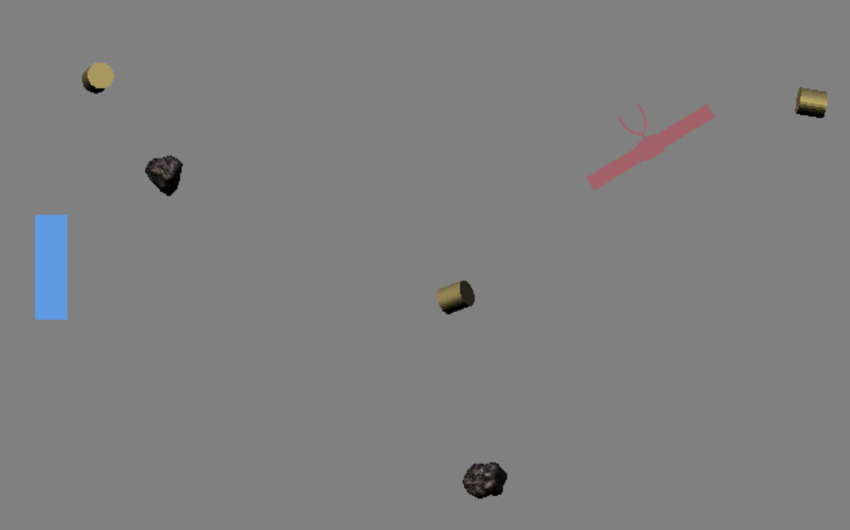

# Game Information
(Note: fill in this portion with information about your game.)

Title: Asteroid Wrangling

Author: Edward Terry

Design Document: Asteroid Wrangling (http://graphics.cs.cmu.edu/courses/15-466-f18/game0-designs/eterry/)

Screen Shot:



Difficulties Encountered:

The difficulties I encountered fell into three categories:
- Managing transformations and dynamics. Depending on the orientation of Blender models, it took some trial and error to orient the models correctly and to coordinate the controls in a consistent way. Tuning the parameters for satellite speed, fuel burn rates and rate of object generation was an iterative process and ultimately converged on a moderately difficult environment.
- Data types for time. I had planned to spawn objects at regular time intervals, but was having trouble converting the current time to a useable type (i.e., float). In the end the trigger to spawn objects was a certain number of update cycles.
- Texture management. I had intended to apply a galaxy background to the game but had a hard time applying a texture to the object in Blender. Despite several attempts, I was unable to achieve a non-black texture.

Good Code:

I was happy with the way I encapsulated the spawning behavior into a single function, which receives the type of object to be created as an argument. This is also the first time I've used inline functions, which prevents the scope expanding beyond its local use. The soundtrack which I recorded and the asteroid model which I made are both unique features which enhance the game atmosphere.

# Using This Base Code

Before you dive into the code, it helps to understand the overall structure of this repository.
- Files you should read and/or edit:
    - ```main.cpp``` creates the game window and contains the main loop. You should read through this file to understand what it's doing, but you shouldn't need to change things (other than window title and size).
    - ```Game.*pp``` declaration+definition for the Game struct. These files will contain the bulk of your code changes.
    - ```meshes/export-meshes.py``` exports meshes from a .blend file into a format usable by our game runtime. You will need to edit this file to add vertex color export code.
    - ```Jamfile``` responsible for telling FTJam how to build the project. If you add any additional .cpp files or want to change the name of your runtime executable you will need to modify this.
    - ```.gitignore``` ignores the ```objs/``` directory and the generated executable file. You will need to change it if your executable name changes. (If you find yourself changing it to ignore, e.g., your editor's swap files you should probably, instead be investigating making this change in the global git configuration.)
- Files you probably should at least glance at because they are useful:
    - ```read_chunk.hpp``` contains a function that reads a vector of structures prefixed by a magic number. It's surprising how many simple file formats you can create that only require such a function to access.
    - ```data_path.*pp``` contains a helper function that allows you to specify paths relative to the executable (instead of the current working directory). Very useful when loading assets.
	- ```gl_errors.hpp``` contains a function that checks for opengl error conditions. Also, the helpful macro ```GL_ERRORS()``` which calls ```gl_errors()``` with the current file and line number.
- Files you probably don't need to read or edit:
    - ```GL.hpp``` includes OpenGL prototypes without the namespace pollution of (e.g.) SDL's OpenGL header. It makes use of ```glcorearb.h``` and ```gl_shims.*pp``` to make this happen.
    - ```make-gl-shims.py``` does what it says on the tin. Included in case you are curious. You won't need to run it.

## Asset Build Instructions

In order to generate the ```dist/meshes.blob``` file, tell blender to execute the ```meshes/export-meshes.py``` script:

```
blender --background --python meshes/export-meshes.py -- meshes/meshes.blend dist/meshes.blob
```

There is a Makefile in the ```meshes``` directory that will do this for you.

## Runtime Build Instructions

The runtime code has been set up to be built with [FT Jam](https://www.freetype.org/jam/).

### Getting Jam

For more information on Jam, see the [Jam Documentation](https://www.perforce.com/documentation/jam-documentation) page at Perforce, which includes both reference documentation and a getting started guide.

On unixish OSs, Jam is available from your package manager:
```
	brew install ftjam #on OSX
	apt get ftjam #on Debian-ish Linux
```

On Windows, you can get a binary [from sourceforge](https://sourceforge.net/projects/freetype/files/ftjam/2.5.2/ftjam-2.5.2-win32.zip/download),
and put it somewhere in your `%PATH%`.
(Possibly: also set the `JAM_TOOLSET` variable to `VISUALC`.)

### Libraries

This code uses the [libSDL](https://www.libsdl.org/) library to create an OpenGL context, and the [glm](https://glm.g-truc.net) library for OpenGL-friendly matrix/vector types.
On MacOS and Linux, the code should work out-of-the-box if if you have these installed through your package manager.

If you are compiling on Windows or don't want to install these libraries globally there are pre-built library packages available in the
[kit-libs-linux](https://github.com/ixchow/kit-libs-linux),
[kit-libs-osx](https://github.com/ixchow/kit-libs-osx),
and [kit-libs-win](https://github.com/ixchow/kit-libs-win) repositories.
Simply clone into a subfolder and the build should work.

### Building

Open a terminal (or ```x64 Native Tools Command Prompt for VS 2017``` on Windows), change to the directory containing this code, and type:

```
jam
```

That's it. You can use ```jam -jN``` to run ```N``` parallel jobs if you'd like; ```jam -q``` to instruct jam to quit after the first error; ```jam -dx``` to show commands being executed; or ```jam main.o``` to build a specific file (in this case, main.cpp).  ```jam -h``` will print help on additional options.
